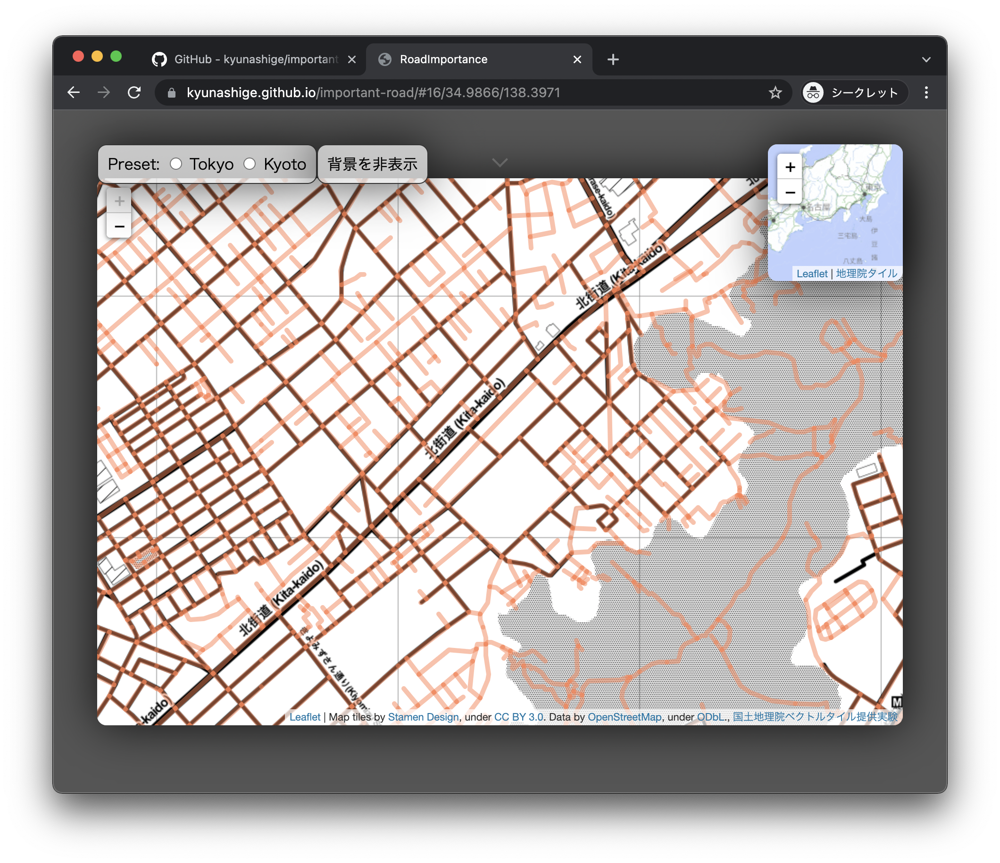
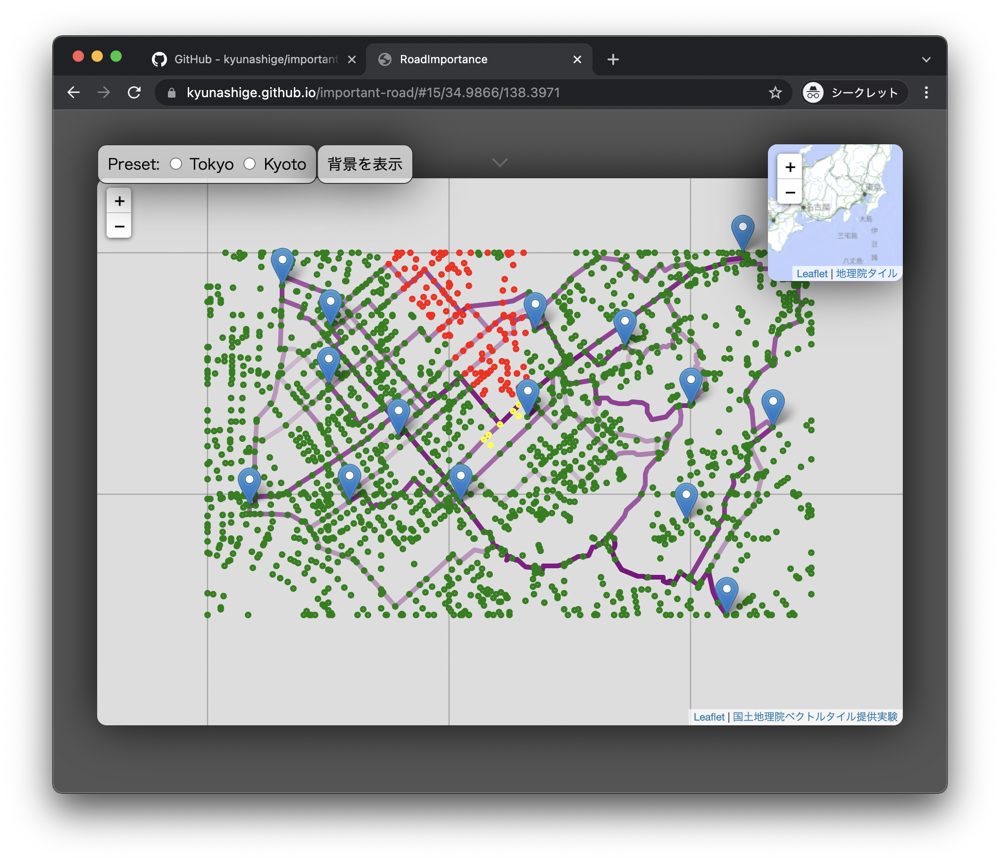

# クリックした道路の重要性を色で伝える

## 背景

-   大学院の講義「時空間情報処理特論」の最終課題
    -   講義で扱ったアルゴリズム（R-Tree, DBSCAN, Dijkstra）を用いて，可視化まで含んだ地理情報アプリケーションを作る
-   「管理者不明橋（勝手橋）」の存在をニュース[^1]で知った
    -   設置者がわからず，誰が管理するか決まっていない橋
    -   住民にとっては，安全が保証されていなくても，近道のために無くてはならない橋なのだそう

[^1]: https://www.yomiuri.co.jp/national/20211122-OYT1T50059/

## 道路の重要度

ここでは，道路中心線[^2]の重要度を可視化してみたい．

多くの地点に多大な影響を与える道路は重要とみなせる．
そこで，道路 e が与える影響度に応じて，各地点を塗り分けすることにした．
緑，黄，赤，黒の 4 色を用いた（緑なら影響なし，黒なら通行できなくなったことを表す）．

---

道路 e が地点 s に与える影響度を次式で定義する．

<!-- $$\max_{\{ランダムに選んだゴール g\}} (e がないときの s\mathrm{-}g 間の最短距離) - (e があるときの s\mathrm{-}g 間の最短距離)$$ -->

---

[^2]: https://github.com/gsi-cyberjapan/experimental_rdcl

## 使い方

1. 調べたい場所を選ぶ
    - マップを D&D したり，拡大縮小したりして選ぶ
    - or 右上のミニマップで指定する
    - or 左上の "Preset" から選ぶ
2. 重要度を調べたい道路をクリックする（オレンジ色 -> 青色に変わる）
    - クリックするたびにゴールが変わる（マーカーで示されている）
    - 各地点への影響度が緑，黄，赤，黒の 4 色で塗り分けられている
    - ゴール同士の最短路が紫色で示されている
    - 全体像を見渡すために，この状態で 2 段階まで縮小できる
    - 背景の表示・非表示を切り替えることができる

## 注意点

-   道路中心線の情報がズームレベル 16 でしか提供されていないため，地図を縮小すると道が消える
-   画面上に表示された範囲（GeoJSON タイル）でしか経路探索しない
    -   本来繋がっている地点も，一部の道が読み込まれていないせいで通れない判定になる可能性がある
    -   解決するには，大きなモニターが必要
